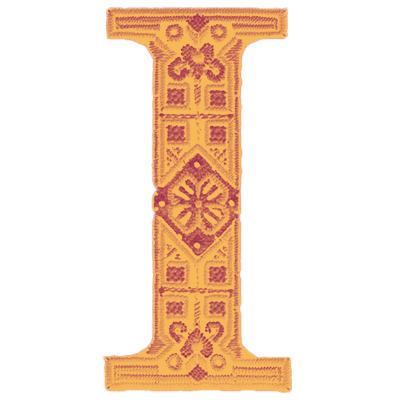

# Artificial   Intelligence   & Craft

## Christopher Sardo

### October 2024

n recent years, the rapid advancement of artificial intelligence and image generation techniques has led to a resurgence of interest in traditional craft and physical mediums within the design community. Designers are increasingly turning to experimentation with calligraphy, print, and textiles as a means of exploring new creative possibilities. However, this trend raises important questions about the sustainability of such practices in the face of constantly developing AI technologies. In particular, how well can current AI models create accurate and compelling depictions of craft, and what implications does this have for the future of design.

This project aims to address these questions through the development of a website database that showcases images of traditional craft generated using the Image generation tools Midjourney and Google's Imagen3. The database, which was coded and developed with the language model Claude, provides a platform for exploring the capabilities and limitations of AI in the context of craft-based design. By examining the generated images and comparing them to real-world examples of craft, the project seeks to shed light on the potential role of AI in shaping the future of design, and to hopefully stimulate further discussion around the topic of craft and AI.

### Generating the images

The AI-generated images in this project depict contemporary interpretations of traditional forms of craft. By presenting these crafts in a contemporary context, the images aim to prompt critical questions about cultural appropriation and the authenticity of such adaptations. The visual styling of the images is both quiet and somber, yet simultaneously bright and engaging, reflecting the complex and often conflicting attitudes surrounding the role of AI in the creative process.

The development process for these AI-generated images involved the use of two distinct image generation models: Imagen3, developed by Google, and Midjourney. The initial prompts were first fed into Imagen3 as it proved to be a powerful tool for generating accurate representations of the prompt without the need for additional references. However, this high level of realism sometimes limited the model's ability to create more artistic and experimental interpretations of the prompts, which were essential for the creative goals of the project. In contrast, Midjourney allowed for generating stylized images with tools such as visual references, aspect ratio adjustments, and upscaling. In addition, Midjourney also excelled at environments, and faces, but struggled with garment details, perfect symmetry, and notably hands. However, by combining the outputs of these two models, the resulting images have a unique feeling of artistic exploration provided by Midjourney and cultural integrity from the realism of Imagen3 that might have been missing if only one model had been used.

### Developing the Site

The website and image database is organized into three distinct categories based on the types of craft depicted. Each AI-generated image serves as an index, linking to real-world examples of the original textiles that inspired it. For instance, images of AI-generated Sami-inspired winter wear lead users to authentic examples of Sami textiles, providing a rich context for understanding the cultural significance and craftsmanship behind these traditional designs. This structure allows users to easily navigate the site and explore the connections between AI-generated images and their real-world counterparts, while also highlighting the diversity of textile traditions from around the world.

The development of the site relied heavily on the use of Claude, a Large language model developed by Anthropic. To begin, a rough sketch of the site structure and layout was coded using Claude only to quickly resolve any CSS and JavaScript issues that arose. Once this initial framework was in place, Claude was used to populate the site with content from a JSON file, allowing for dynamic updates to the images and descriptions without the need for manual styling adjustments. Finally, Claude was leveraged to add micro-interactions and other engaging elements to the site, such as a dynamic cursor and section-specific color schemes, enhancing the overall user experience and visual appeal of the platform.

### The Resurgence of Craft in Graphic Design

The resurgence of craft in graphic design represents a fascinating counterpoint to the rise of artificial intelligence and digital tools. Historically, graphic design emerged from traditional crafts like typography, printmaking, and illustration before evolving into a largely digital discipline by the late 20th century (Meggs, 2016). However, recent years have seen a renewed interest in physical mediums and handmade aesthetics among designers.

This craft revival can be attributed to several factors. As Ritupriya Basu notes, there is a "collective hunger for the charm and beauty of the handcrafted" in response to the ubiquity of digital design (Basu, 2024). Handmade elements add texture, intimacy, and a human touch that resonates emotionally with audiences. The tactile nature of craft processes also provides a counterbalance to screen-based work, allowing designers to engage different creative muscles. Additionally, craft techniques can yield serendipitous imperfections and happy accidents that are difficult to replicate digitally.
Contemporary designers are embracing craft in myriad ways. Studio Chenchen's branding for Stappa wines features expressive hand-drawn illustrations that capture a "rebellious humour and spirit" (Basu, 2024). Stop-motion animation and puppetry have also seen a resurgence, as exemplified by adam&eveDDB's Marmite campaign featuring handmade sock puppets. The physicality of these techniques lends an authenticity that resonates with audiences. As designer Jennifer Kidd observes, "There's a hands-on aspect to analog work that fosters a deeper connection between creator and project" (Basu, 2024). This craft revival demonstrates how traditional techniques can coexist with and even be enhanced by new technologies in graphic design.

### AI from Ideation to Art

The role of artificial intelligence in the creative arts has evolved significantly, transitioning from a tool for ideation and assistance to an accepted artistic medium in its own right. Initially, AI was primarily viewed as a way to support creative production tasks, with artists expressing willingness to use AI tools for tasks like image searching and editing (Anantrasirichai and Bull, 2021). However now, as AI technologies have advanced, particularly in areas like neural networks (computer systems modeled on the human brain) and generative adversarial networks (GANs - systems where two AI networks compete to generate and evaluate content), they have increasingly been embraced as legitimate tools for artistic expression.

This evolution is exemplified by works like POST by Sander Coers, which deliberately uses AI-generated imagery to explore themes of constructed memories and masculinity. Rather than trying to hide the AI's involvement, Coers explicitly leverages the technology's ability to generate false but convincing historical photographs based on his grandparents' photo albums. The project demonstrates how AI can be used not just as a technical tool, but as an integral part of the artistic concept itself, helping to question the authenticity of photography and memory in the digital age (Coers, 2024).

The acceptance of AI as an artistic medium represents a significant shift in how the creative industry views artificial intelligence. Research indicates that three-quarters of artists across the US, UK, Germany, and Japan would consider using AI tools as assistants, particularly for tasks like image searching and editing (Anantrasirichai and Bull, 2021). This is evidenced by POST's successful exhibition at prestigious venues like Foam in Amsterdam and Photo London, demonstrating that the art world increasingly recognizes AI-generated work as valid artistic expression. However, research suggests that maximum benefit comes when AI is used to augment rather than replace human creativity, pointing to a future where human and machine creativity work in synergy (Anantrasirichai and Bull, 2021).

### Ethical Concerns

The integration of artificial intelligence in craft, design, and art has raised significant concerns regarding cultural appropriation and ethical dilemmas. As AI systems become increasingly sophisticated in generating and manipulating visual content, there is a growing risk of misappropriating cultural symbols, motifs, and techniques without proper understanding or respect for their origins, This is particularly problematic when AI models are trained on public datasets that include traditional art and forms and craft techniques from Indigenous and marginalized communities, potentially leading to the creation of AI-generated works that superficially mimic these cultural expressions without capturing their deeper meanings or contexts (Shea, 2024).

In addition, it raises fundamental questions about authenticity and the value of human craftsmanship. As AI-generated images become increasingly ubiquitous, there is a growing concern that the unique skills and cultural knowledge embedded in traditional craft practices may be lost entirely (Pimevera, 2023). However, paradoxically this may lead to an increased appreciation for human-made crafts. As the world becomes saturated with AI-generated images, consumers may increasingly seek out the imperfections and variations of handmade items as markers of authenticity (Pimevera, 2023). This tension between technology and cultural preservation presents a complex ethical challenge for designers and artists working with AI. It necessitates that designers strike a careful balance between embracing new technologies and engaging with consumer demands, all while safeguarding the irreplaceable value of human creativity and traditional craftsmanship.

In response to these ethical considerations, it is crucial for artists and designers to develop comprehensive frameworks and guidelines for the responsible use of AI in craft, design, and art. As outlined by Lewis in "Guidelines for Indigenous-centred AI Design," this may involve collaborating with cultural knowledge holders and Indigenous communities to ensure that AI systems are developed and used in ways that respect cultural protocols and intellectual property rights (Lewis). Additionally, there is a need for increased transparency in AI-generated works, clearly distinguishing between human-created and AI-assisted works. By fostering a more collaborative and open understanding of the relationship between AI and traditional craft practices, the future of AI may not be one of erasure.

### Concluding Thoughts

This exploration of the intersection between artificial intelligence, art, and craft in graphic design reveals a complex and evolving creative landscape that offers compelling possibilities for the future. As AI tools like Midjourney continue to advance, they present opportunities for enhancing creativity and streamlining workflows in ways that can complement, rather than replace, human ingenuity. The history of graphic design demonstrates that new technologies have consistently transformed creative practices, from movable type to digital design software (Meggs, 2016). Each innovation has been met with a mix of enthusiasm and skepticism from artists and designers. AI represents the latest chapter in this ongoing dialogue between technology and human creativity. While AI can generate impressive visuals and assist with ideation, it serves as a powerful tool that augments human capabilities rather than diminishes them. The value of craft and the "human touch" remains essential, even as AI enhances certain aspects of the design process (Woodbridge, 2017).

Looking ahead, the most promising path forward involves embracing a collaborative relationship between human designers and AI tools. By leveraging AI for tasks like rapid prototyping and data analysis, designers can focus more energy on high-level creative direction, storytelling, and solving complex visual communication challenges. At the same time, a renewed appreciation for analog craft techniques may emerge alongside digital innovation, creating a rich hybrid approach to design. The future of graphic design will be shaped by those who can thoughtfully integrate cutting-edge AI capabilities with timeless principles of visual communication and artistry. Ultimately, AI should be viewed as one of many tools in the designer's expanding toolkit - one that enhances rather than replaces the irreplaceable spark of human imagination (Fiebrink 2019).

